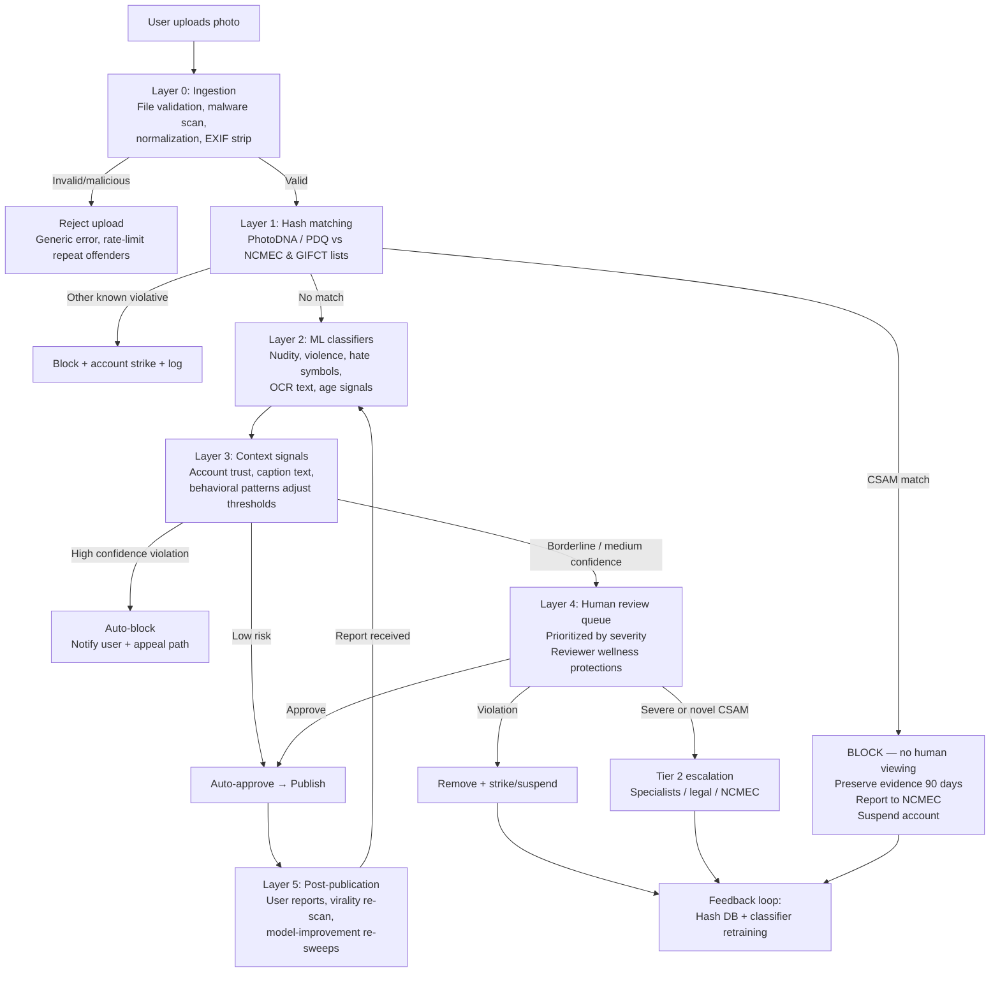

# Content Moderation Guardrails Architecture

An end-to-end design for automated photo moderation in a social media app, from upload to approval. The core principle is **layered defense in order of certainty**: cheap deterministic checks first, probabilistic ML in the middle, humans for the ambiguous residue.

## Pipeline Overview

## Layer 0 — Ingestion & Pre-processing

**Checks:** File type validation, size limits, malware scanning, decompression-bomb protection, and normalization (decode the image, strip EXIF for privacy, generate a canonical version so later layers all analyze the same pixels — this also defeats trivial evasion like appending junk bytes).

**On trigger:** Hard reject with a generic error. No escalation needed — this is hygiene, not policy. Rate-limit or throttle accounts that repeatedly fail here.

## Layer 1 — Known-Content Hash Matching

**Checks:** Perceptual hashes (PhotoDNA, PDQ, Google CSAI Match for video) compared against industry hash databases — NCMEC's for CSAM, GIFCT's for terrorist content. Perceptual hashing catches resizes, crops, and re-encodes, not just exact copies.

**On trigger (CSAM match)** — the one path with zero discretion:

- Block immediately; never publish, never show to a human reviewer for a "second opinion."
- Preserve the file and metadata in a restricted evidence store (US law requires 90-day preservation).
- File a CyberTipline report to NCMEC — a legal mandate for US providers under 18 U.S.C. § 2258A.
- Suspend the account pending investigation; log everything with strict access controls.

**On trigger (other known violative content):** Block, strike the account, log. No human review needed for exact/near matches — that's the point of hash lists.

Hash matching only catches *known* material. Novel CSAM detection falls to Layer 2 classifiers (age + sexual-content signals combined), and confirmed novel material feeds back into the hash database.

## Layer 2 — ML Classification (Synchronous, Pre-publish)

**Checks:** Parallel classifiers for nudity/sexual content, graphic violence/gore, hate symbols, weapons, and self-harm imagery, plus OCR to extract and classify text embedded in the image. Each classifier returns a confidence score.

**On trigger** — thresholds do the work here:

| Confidence | Action |
|---|---|
| High confidence violation | Auto-block; notify user with policy cited; offer appeal path |
| Medium / borderline | Route to human review queue (hold, or publish with reduced distribution pending review — tiered by category severity; anything potentially involving a minor always holds) |
| Low / clean | Auto-approve and publish |

Thresholds are per-category (far lower tolerance for false negatives on child safety than on mild nudity) and tuned continuously against reviewer decisions.

## Layer 3 — Contextual & Behavioral Signals

**Checks:** Signals the pixels alone can't provide: account trust score (age, history, prior strikes), caption and hashtag text, posting velocity, and known abuse patterns (new account + bulk upload + borderline content reads very differently from a ten-year account posting a beach photo).

**On trigger:** Mostly *modulates* Layer 2 rather than blocking on its own — lowers the review threshold for low-trust accounts, fast-tracks high-trust accounts. Coordinated-abuse patterns escalate to a specialist investigations team rather than the general review queue.

## Layer 4 — Human Review Queue

**Checks:** Everything the ML couldn't decide, prioritized by severity (child safety > violence > nudity) and predicted reach.

**On trigger:** Reviewer decisions: approve, remove + strike, remove + suspend, or escalate to Tier 2 (policy specialists, legal, or law enforcement liaison for credible threats and suspected novel CSAM).

Two commonly underbuilt requirements:

- **Reviewer wellness protections** — blurred-by-default images, exposure limits, mandatory counseling access.
- **Decision logging** — reviewer labels are the training data for retuning Layer 2.

## Layer 5 — Post-publication Safety Net

**Checks:** User reports, proactive re-scanning of live content when models improve, and virality triggers (content crossing a reach threshold gets a second automated pass or review).

**On trigger:** Reported content re-enters the pipeline at Layer 2 with the report as an added signal. Appeals go to a *different* reviewer than the original decision. Confirmed violations feed the hash database and classifier training sets — this feedback loop is what makes the system get better instead of just bigger.

## Key Architectural Decisions

**Latency budget.** Layers 0–2 run synchronously before publish; target under ~2 seconds total. Hash matching is milliseconds; the ML pass is the bottleneck. Layer 5 is fully async.

**Fail closed on severity, fail open on convenience.** If the CSAM hash service is down, uploads queue — they don't skip the check. If a low-severity classifier times out, publish and re-scan async. Define this per layer before an outage forces the decision.

**Don't build CSAM detection in-house.** Use vetted services (PhotoDNA via Microsoft, Google Content Safety API, Thorn's Safer) — they exist precisely so individual platforms don't handle raw CSAM datasets, and access is legally gated. The platform's job is the plumbing around them: blocking, preservation, NCMEC reporting, and access controls, reviewed with counsel since reporting obligations vary by jurisdiction.

**Measure both error directions.** Track false negatives (violations that shipped, caught via reports) and false positives (appeal overturn rate). A system tuned on only one will drift toward either censorship complaints or safety failures.
